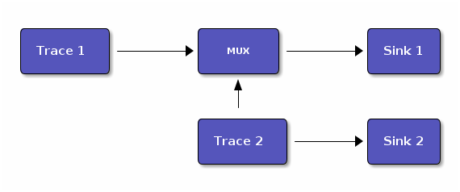
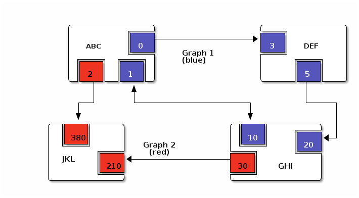

# 

# Introduction

This is the ACPI \_DSD Implementation Guide. This guide and its
associated documents provide recommendations on the use of the \_DSD
(Device Specific Data) object as defined in the ACPI Specification
[\[ACPI\]](#ACPI). The \_DSD object is a device specific configuration
object, intended for firmware and software engineers implementing \_DSD
or designing software that will use information supplied by the object.

The \_DSD, as defined by the ACPI Specification, returns a Package, the
first and every odd element of which is a Universal Unique Identifier
(UUID) and every even element of which is a Package (Data Structure),
where each of the UUIDs dictates the format of the Data Structure
immediately following it. The well-known UUIDs to use in the \_DSD
output and the Data Structure formats associated with them are also
specified in this document.

## Copyright and License Information

The \_DSD Implementation Guide is © 2021, Unified Extensible Firmware
Interface (UEFI) Forum, Inc. More specifically, content is under the
purview of the ACPI Specification Working Group (ASWG)
\<<aswg@uefi.org>\>.

The \_DSD Implementation Guide is licensed under the Creative Commons
Attribution 4.0 International License (CC-BY 4.0). The full license text
is available at <https://creativecommons.org/licenses/by/4.0/>.

## Change Log

  - Version 2.0
    
      - Initial conversion to asciidoc from original v1.2.
    
      - General text rewrites and reformatting.
    
      - Expand the Terms section.
    
      - Add a licensing section.
    
      - Add a bibliography and references section.
    
      - Add in process and naming recommendations.

## Quick Start Guide

  - ***If you are new to ACPI***: please start with the ACPI
    specification (see [\[ACPI\]](#ACPI)) and in particular section
    6.2.5, "\_DSD (Device Specific Data)".

  - ***If you are new to using `_DSD` in ACPI***: please start by
    reading or reviewing section 6.2.5, "\_DSD (Device Specific Data)"
    in [\[ACPI\]](#ACPI).

  - ***If you are looking for details about a specific `_DSD` UUID***:
    these are all defined in section [Well-Known UUIDs and Data
    Structure
    Formats](#_well_known_dsd_uuids_and_data_structure_formats). The
    UUIDs are:
    
      - Device Properties UUID: in section [Device Properties
        UUID](#_device_properties_uuid)
    
      - Hierarchical Data Extension UUID: in section [Hierarchical Data
        Extension UUID](#_hierarchical_data_extension_uuid)
    
      - Device Graph UUID: in section [Device Graph
        UUID](#_device_graph_uuid)

  - ***If you are looking for currently defined UEFI Device
    Properties***: see section [UEFI Defined Device Property
    Usage](#_uefi_defined_device_property_usage).

  - ***If you are looking for currently defined Device Property
    Prefixes***: see section [Known Device Property
    Prefixes](#_known_device_property_prefixes).

  - ***If you wish to register a Device Property Prefix***: please see
    section [Known Device Property
    Prefixes](#_known_device_property_prefixes) for currently defined
    prefixes, and section [Registering
    Prefixes](#_registering_prefixes).

## Terms

The key words **MUST**, **MUST NOT**, **REQUIRED**, **SHALL**, **SHALL
NOT**, **SHOULD**, **SHOULD NOT**, **RECOMMENDED**, **MAY**, and
**OPTIONAL** in this document are to be interpreted as described in IETF
[\[RFC2119\]](#RFC2119).

The following additional terms are used in this document:

  - ACPI  
    Advanced Configuration and Power Interface specification.

  - ASWG  
    ACPI Specification Working Group

  - DCO  
    Developer’s Certificate of Origin [\[DCO\]](#DCO)

  - Device  
    Hardware component or set of interrelated hardware registers.

  - Device ID  
    Plug and Play ID or ACPI ID of a device.

  - GUID  
    Globally Unique Identifier. A 128-bit value used to uniquely name
    entities. A unique GUID can be generated by an individual without
    the help of a centralized authority. This allows the generation of
    names that will never conflict, even among multiple, unrelated
    parties.

  - OSPM  
    Operating System Power Management

  - PNP  
    Plug and Play

  - UEFI  
    Unified Extensible Firmware Interface

  - UUID  
    Universal Unique Identifier, a synonym for GUID.

## Conventions

The following typographic connventions are used:

  - Computer Text  
    `monospace text` is used to represent computer inputs or outputs.

  - Stress  
    **bold text** is used to add emphasis to terms.

  - Terms  
    *italic text* is used to highlight important terminology.

## References

## 

Advanced Configuration and Power Interface (ACPI) Specification, Version
6.3, January 2019. Copyright (c) 2018, Unified Extensible Firmware
Interface (UEFI) Forum, Inc. <https://uefi.org/specifications>

Developer’s Certificate of Origing. <https://developercertificate.org/>

<https://www.ietf.org/rfc/rfc2119.txt>

# General Recommendations

## Using `_DSD` versus `_DSM`

Although in principle the `_DSM` (Device Specific Method) may be used to
implement the functionality provided by `_DSD`, it is not recommended to
do so. Since `_DSD` is better suited for providing device configuration
data, it should be used for this purpose where applicable. However,
there are situations in which where using `_DSM` instead of `_DSD` needs
to be considered. Generally, all situations in which it would be
necessary to implement `_DSD` as a `Method()` for technical reasons fall
into this category, but in particular `_DSD` should not write into
device registers in addition to returning the data. In addition to that,
`_DSD` must return the same data every time it is evaluated, so if that
cannot be guaranteed, `_DSM` has to be used instead.

## General `_DSD` Definition Template

Wherever possible, it is recommended to implement `_DSD` as a `Name()`
as opposed to a `Method()` in order to avoid possible programmatic
errors and computational overhead that are sometimes associated with the
execution of AML (ASL Machine Language) code. In that case the
definition of `_DSD` should follow this template:

**General `_DSD` Template.**

Name (\_DSD, Package () { ToUUID("UUID1"), Package () { ... },
ToUUID("UUID2"), Package () { ... }, ... ToUUID("UUIDn"), Package () {
... } })

As noted in the introduction, `_DSD` returns a `Package()` with one or
more pairs of elements. The first element of each pair — i.e., the first
and every following odd element of the total `Package()` — is a
Universal Unique Identifier (UUID). The second element of each
pair — and every even element of the total `Package()` — is
another `Package()` Data Structure. Each UUID dictates the format and
content of the Data Structure immediately following it.

Only the well-known UUIDs and their corresponding Data Structures
defined in this guide should be used. The behavior of any other UUIDs
and Data Structures are **undefined**.

# Well-Known `_DSD` UUIDs and Data Structure Formats

## Device Properties UUID

This section specifies the data format associated with UUID:

**daffd814-6eba-4d8c-8a91-bc9bbf4aa301**

(Device Properties UUID) for the `_DSD` (Device Specific Data) ACPI
device configuration object.

### Data Format Definition

The device properties UUID:

**daffd814-6eba-4d8c-8a91-bc9bbf4aa301**

defines the data format for the `Package()` (Data Structure) immediately
following it as a list of Packages of length two (2), known as
Properties. The first element of each Property (the Key) must be a
String and the second element (the Value) must be:

  - an Integer,

  - a String,

  - a Reference, or

  - a Package consisting entirely of Integer, String, or Reference
    objects (and specifically not containing a nested Package).

The list of valid Keys, and the format and interpretation of the
corresponding Values, depends on the PNP or ACPI device ID (e.g.,
`_HID`) of the Device containing the `_DSD`. For instance, the PNP
device ID returned by `_HID` for Device object `MDEV` below will
determine the list of valid Keys and the corresponding Value data
formats for that Device object’s `_DSD`.

    Device (MDEV) {
        Name (_HID, "PNP####")
    
        Name (_DSD, Package () {
            ToUUID("daffd814-6eba-4d8c-8a91-bc9bbf4aa301"),
            Package () {
                Package (2) {...},     // Property 1
                Package (2) {...},     // Property 2
                ...
                Package (2) {...}      // Property n
            }
        })
        ...
    }

In the context of the Device Properties UUID, each Property is a
characteristic of the hardware itself or the way it is used in the
system in which it is incorporated, as opposed to software configuration
data. As such, the list of valid property Keys and Value data formats
associated with them must be defined by the device vendor in a way that
is independent of the firmware interface to be used on any given
platform.

Multiple Properties with the same Key in a single Data Structure
associated with the Device Properties UUID are not permitted.

### Device Properties UUID Rules

Properties described in a Device Properties UUID `_DSD` are intended to
be used in addition to, and not instead of, the existing mechanisms
defined by the ACPI specification. For this reason, as a rule, Device
Properties should only be used if the ACPI specification does not make
direct provisions for handling the underlying use case. ACPI provides a
number of generic interfaces to operating systems kernels, and these
should continue to function without requiring the kernels to directly
parse a device properties `_DSD`. For example, properties that describe
how to turn voltage regulators, or clocks, on and off, should not be
used, as these should be managed via power resource `_ON`/`_OFF`
methods, or device `_PSx` methods.

It is not permitted to use Properties in a data structure associated
with the Device Properties UUID to provide the OSPM and device drivers
with the same information that can be provided as device resources via
`_CRS` (Current Resource Settings). In case of any conflicts between
such Properties and the information returned by `_CRS`, the latter
always takes precedence.

Properties of a Device may depend on the order of the resources provided
via `_CRS` or the order of the resources of a particular type. For
instance, a Property may identify an IRQ via an index into the IRQ
resources provided via `_CRS` rather than providing an absolute IRQ
number. This avoids duplication between the Properties and `_CRS`,
making it easier to change the resources of a Device in one place.

### Device Property Naming

While the Key for a Property may be any String, there is a very high
probability of name collision. For example, two vendors could use the
String `"serial-number"` as a Key. The problem is that each vendor may
have very different use cases for the Value. One use case could be a
Boolean value (`"yes"` means the device has a read-only register that
contains a serial number, `"no"` means the device has no such register).
A second use case could be that the value is the actual serial number
("abcde-123456").

It is highly recommended that each vendor prefix their Key name with
their registered PNP or ACPI vendor ID in order to avoid name
collisions. What the vendor decides to use after the prefix is
completely up to their own discretion. For example, Vendor ABCD would
use `abcd-serial-number` instead of `serial-number`, especially if the
word or term is known to be in common use. Please see [Registering
Prefixes](#_registering_prefixes) for instructions on obtaining a vendor
prefix.

Due to historical usage, Appendix A
[appendix\_title](#_deprecated_device_properties) contains a list of
Keys that do not have any prefix at all. These should not be used in the
future; they should be considered deprecated. In Appendix B [UEFI
Defined Device Property Usage](#_uefi_defined_device_property_usage:),
prefixed names for these same Keys are defined and should be used
henceforth.

The reason these older Key definitions have no prefix is that there was
at one time the concept of a global namespace for these Keys, and a
process for registering them and defining them. As a practical matter,
hardware and software vendors have ignored the whole thing and used the
Keys in Appendix A as *de facto* standards. While we still have the idea
of a global namespace for Keys, from now on these must be prefixed with
`uefi-` in the interest of avoiding name collisions.

Property names that are not one of those grandfathered in through
Appendix A, or defined in Appendix B, or use a prefix not listed in
Appendix C must not be used. The use of `_DSD` Device Properties under
those circumstance may have unpredictable outcomes.

There is no need to change existing implementations.

As a pragmatic matter, the use of prefixes and control of the name space
as described here is **optional** so that we do not disturb existing OS
implementations and usage. Existing Device Properties can continue to be
used as they are today; there is no requirement to change them to use
the new prefix scheme.

However, we **highly recommend** that prefixes be used and that they be
registered from this point on for future or new Device Properties. It is
ultimately in everyone’s best interest to be clear on who owns what
Device Properties, and who is responsible for defining them.

### Adding UEFI Device Properties

In order to create a Device Property in the `uefi` namespace, it must be
provided as a merge request (MR) to this document via github (see
<https://github.com/UEFI/DSD-Guide>, and the file `src/dsd-guide.adoc`).
When submitting the MR, please provide a rationale for singling out this
Key/Value pair as something that needs to be defined globally. Further,
please provide a description of how the Key/Value pair is to be used,
with a definition of the allowed values, and a brief example. Something
similar to the definitions in Appendix B [UEFI Defined Device Property
Usage](#_uefi_defined_device_property_usage:) will speed up the process.

Each MR will be reviewed by the UEFI Forum (specifically, the ACPI
Specification Working Group or ASWG) at the next available opportunity.
Acceptance, refusal, or suggested improvements, will be discussed on
github.

Once accepted, the MR will be merged into this document as part of the
next release.

Please note that each MR must also provide a Developer’s Certificate of
Origin [\[DCO\]](#DCO) before it can be merged into this document.

### Registering Prefixes

In Appendix C [Known Device Property
Prefixes](#_known_device_property_prefixes) is a list of the currently
known Key prefixes. Any vendor wishing to claim a prefix may do so by
requesting a merge request (MR) to this document via github (see
<https://github.com/UEFI/DSD-Guide>, and the file `src/dsd-guide.adoc`).
When submitting the MR, there are only two things needed: the change
requested to Appendix C [Known Device Property
Prefixes](#_known_device_property_prefixes) and a Developer’s
Certificate of Origin [\[DCO\]](#DCO).

How the vendor chooses to define anything after their prefix is entirely
up to them. For example, always assume that `abcd-frammis` and
`lmno-frammis` are very different Keys, even though both have `frammis`
in the name; vendor `abcd` and vendor `lmno` could have radically
different semantics for the term `frammis`.

Each MR will be be reviewed by the maintainers of this document.
Acceptance, refusal, or suggested improvements, will be discussed on
github.

Once accepted, the MR will be merged into this document as part of the
next release.

### Examples

#### Example Valid Property Representations

The following examples illustrate valid Property Value data types for
the Device Properties UUID.

    Package (2) {"xxyy-length", 16}
    Package (2) {"xxyy-device", \_SB.FOO.BAZ}
    Package (2) {"xxyy-sizes", Package (3) {16, 32, 0}}
    Package (2) {"xxyy-labels", Package (4) {"foo", _SB.FOO, "bar", __SB.BAR)}
    Package (2) {"xxyy-default-state", "on"}

Please note that the use of the prefix `xxyy-` is an example **only**,
and is not meant to reflect any vendor’s actual usage.

### Dependencies on `_CRS` When Using `_DSD`

The following example illustrates a dependency of Properties returned by
`_DSD` (with the Device Properties UUID) on device resources returned by
`_CRS`. In this particular case, the `"gpios"` Properties returned by
the `_DSD` for devices `LEDH` and `LEDM` contain references to `GpioIo`
resources in the `_CRS` of device `LEDS`.

Each of these references consists of a path to the device object
containing the `_CRS` in question and three integer numbers. The first
two of these numbers are indexes to the `_CRS` content. Specifically,
they are the index of the `GpioIo` resource and the index of the pin in
that resource’s GPIO pin list pointed to by the given reference,
respectively. The fourth number is an additional parameter to be
consumed by the driver of the `LEDS` device.

This means that the `"gpios"` Property of device `LEDH` in this example
points to the first (index 0) `GpioIo` resource in the `_CRS` of device
`LEDS` and to the first (index 0) pin in its GPIO pin list (pin 10). In
turn, the `"gpios"` Property of device `LEDM` points to the second
(index 1) `GpioIo` resource in the `_CRS` of device `LEDS` and to the
first (index 0) pin in its GPIO pin list (pin 11).

    Scope (\_SB.PCI0.LPC)
    {
        Device (LEDS)
        {
            Name (_HID, "PNP####")
    
            Name (_CRS, ResourceTemplate ()
            {
                GpioIo (Exclusive, PullDown, 0, 0, IoRestrictionOutputOnly,
                        "\\_SB.PCI0.LPC", 0, ResourceConsumer,,) { 10 }
                GpioIo (Exclusive, PullUp, 0, 0, IoRestrictionInputOnly,
                        "\\_SB.PCI0.LPC", 0, ResourceConsumer,,) { 11 }
            })
    
            Device (LEDH)
            {
                Name (_HID, "PNP####")
                Name (_DSD, Package () {
                    ToUUID("daffd814-6eba-4d8c-8a91-bc9bbf4aa301"),
                    Package () {
                        Package (2) {"label", "Heartbeat"},
                        Package (2) {"gpios", Package (4) {
                                                \_SB.PCI0.LPC.LEDS, 0, 0, 1
                        }},
                        Package (2) {"default-trigger", "heartbeat"},
                        Package (2) {"default-state", "on"},
                        Package (2) {"retain-state-suspended", 1},
                    }
                })
            }
    
            Device (LEDM)
            {
                Name (_HID, "PNP####")
    
                Name (_DSD, Package () {
                    ToUUID("daffd814-6eba-4d8c-8a91-bc9bbf4aa301"),
                    Package () {
                        Package (2) {"label", "MMC0 Activity"},
                        Package (2) {"gpios", Package (4) {
                                                \_SB.PCI0.LPC.LEDS, 1, 0, 1
                        }},
                        Package (2) {"default-trigger", "mmc0"},
                        Package (2) {"default-state", "on"},
                        Package (2) {"retain-state-suspended", 1},
                    }
                })
            }
        }
    }

## Hierarchical Data Extension UUID

This section specifies the data format associated with UUID:

**dbb8e3e6-5886-4ba6-8795-1319f52a966b**

(Hierarchical Data Extension UUID) for the `_DSD` (Device Specific Data)
ACPI device configuration object.

### Data Format Definition

The Hierarchical Data Extension UUID:

**dbb8e3e6-5886-4ba6-8795-1319f52a966b**

defines the data format for the `Package()` (Data Structure) immediately
following it as a list of Packages of length two (2), known as Sub-node
Links. The first element of each Sub-node Link (the Key) must be a
String and the second element (the Target) must be either a String
encoding the name of the referenced ACPI object or a reference to the
ACPI object. That name can be a fully qualified path, a relative path,
or a simple name segment utilizing the ACPI namespace search rules as
defined by the ACPI specification [\[ACPI\]](#ACPI) (Section 5.3 “ACPI
Namespace”, Section 19.2.2 “ASL Name and Pathname Terms” and Section
19.3.2.2 “Strings”).

Moreover, the ACPI object pointed to by the Target (the Target Object)
must evaluate to a Package formatted in accordance with the `_DSD`
return value format defined by the ACPI specification (Section 6.2.5).
Also, like `_DSD`, it must return the same data every time it is
evaluated and the meaning of those data is the same as for analogous
data returned by `_DSD`.

The Key of each Sub-node Link must be unique within the enclosing Data
Structure. That is, it is invalid to put two Sub-node Links with
identical Keys into one enclosing Package.

This allows hierarchical device configuration information to be
represented as a hierarchy of ACPI objects returning Packages following
the `_DSD` data Package formatting rules. Then, each of those objects
may be regarded as a Data-only Subnode of the Device object holding the
`_DSD` at the top of the hierarchy.

For maximum interoperability, it is recommended to put all Target
Objects referenced as Strings into the same scope in which the objects
that return data including their names are located. If using object
references, the resolution of the referenced object is managed by the
AML interpreter, and there is no limitation placed on the location of
the referenced object.

If the Target of any property within a Package is a Reference, then all
Targets within and beneath the Package must also be References, not
Strings. Implementers are encouraged to use exclusively Strings or
References throughout the hierarchy.

### Example

The following example illustrates the possible use of the Hierarchical
Data Extension UUID and Sub-node Links. It contains a definition of a
master Device (`SWC0`), three Data-only Sub-nodes (`DP0P`, `DPNP`,
`DP00`) and one child Device object (`SWD0`) under it. In addition, the
Data-only Sub-node `DP00` is a Sub-node of `DPNP` (which is a direct
Sub-node of the master Device). Additionally, a common set of properties
(`COMN`) is provided and referenced by `DP0P`, `DPNP`, and `DP00`. This
allows the firmware developer to ensure that information common to
multiple devices is identical.

    Device(SWC0) {
        Name(_HID, "VEND0000") // sample Vendor ID - do not use
        Name(_DSD, Package() {
            ToUUID("daffd814-6eba-4d8c-8a91-bc9bbf4aa301"),
            Package () {
                Package (2) {...}, // Property 1
                ...
                Package (2) {...}, // Property n
            },
            ToUUID("dbb8e3e6-5886-4ba6-8795-1319f52a966b"),
            Package () {
                Package (2) {"Alice", "DP0P"} // String example
                Package (2) {"Frank", “DPNP”} // String example
            }
        })
    
        Name(DP0P, Package(){ // Data-only subnode of SWC0
            ToUUID("daffd814-6eba-4d8c-8a91-bc9bbf4aa301"),
            Package () {
                Package (2) {...}, // Property 1
                ...
                Package (2) {...} // Property n
            },
            ToUUID("dbb8e3e6-5886-4ba6-8795-1319f52a966b"),
            Package () {
                Package (2) {"common-properties", ^COMN} // Reference
            }
        })
    
        Name(DPNP, Package(){ // Data-only subnode of SWC0
            ToUUID("daffd814-6eba-4d8c-8a91-bc9bbf4aa301"),
            Package () {
                Package (2) {...}, // Property 1
                Package (2) {...} // Property 2
            },
            ToUUID("dbb8e3e6-5886-4ba6-8795-1319f52a966b"),
            Package () {
                Package (2) {"child-of-Frank", "DP00"},
                Package (2) {"common-properties", ^COMN} // Reference
            }
        })
    
        Name(DP00, Package(){ // Data-only subnode of DPNP
            ToUUID("daffd814-6eba-4d8c-8a91-bc9bbf4aa301"),
            Package () {
                Package (2) {...}, // Property 1
                ...
                Package (2) {...} // Property n
            },
            ToUUID("dbb8e3e6-5886-4ba6-8795-1319f52a966b"),
            Package () {
                Package (2) {"common-properties", ^COMN} // Reference
            }
        })
    
        Device (SWD0) {
            Name(_ADR, ...)
            Name(_DSD, Package() {
                ToUUID("daffd814-6eba-4d8c-8a91-bc9bbf4aa301"),
                Package () {
                    Package (2) {...}, // Property 1
                    ...
                    Package (2) {...} // Property n
                }
            })
        } // End SWD0
    
        Name(COMN, Package() { // Common properties
            ToUUID("daffd814-6eba-4d8c-8a91-bc9bbf4aa301"),
            Package () {
                Package (2) {...}, // Property 1
                ...
                Package (2) {...} // Property n
            }
        }) // End COMN
    
    } // End SWC0

## Device Graph UUID

Graphs are a concept that is often observed in computing. A graph is a
set of *nodes* that are connected together through *links* that
represent logical relationships. Often, hardware components relate to
each other functionally, or have physical connections to each other,
forming a graph. An example is shown below.

This Debug Trace Graph includes Trace Sources (Trace 1 and Trace 2) that
produce traces, multiplexors that combine traces from one or more
sources, and multiple Sinks to which traces are fed. The Traces could be
generated by debug logic attached to devices or logical blocks in a
system. Some OS drivers need to be able to process graphs such as these
in order to function properly.

This section specifies the data format associated with UUID:

**ab02a46b-74c7-45a2-bd68-f7d344ef2153**

(Device Graph UUID) for the `_DSD` (Device Specific Data) ACPI device
configuration object.

### Data Format Definition

The Device Graph UUID:

**ab02a46b-74c7-45a2-bd68-f7d344ef2153**

defines the format of a Package Data Structure containing a set of one
or more Graph Entries; the Data Structure is as follows:

    Package () {
        Revision,                 // Integer, must be zero
        NumberOfGraphs,           // N in the list below
        Graph[1],                 // N graphs that this device belongs to
        ...
        Graph[N]
    }

Each Graph Entry (`Graph[n]` above) is in turn a Package with the
following format:

    Package () {
        GraphID,       // Integer, identifies a graph the
                       // parent device belongs to
        UUID,          // 16-byte buffer UUID for
                       // specification that governs this
                       // graph
        NumberOfLinks, // Integer for number of links on this
                       // node
        Links[1],      // List of graph links, with
                       // NumberOfLinks entries.
        ...
        Links[N]
    }

Finally, each Link in a Graph Entry is a package with the following
format:

    Package () {
        SourcePortAddress,           // Integer
        DestinationPortAddress,      // Integer
        DestinationDeviceName,       // Reference to another
                                     // device in the name space
    }

Devices represent vertices in a Graph. A device can indicate that it
participates in a graph by providing a `_DSD` Graph object in its scope.
The object primarily lists the connections the device has to other
devices in a given graph. The `_DSD` Graph object has the following
fields:

  - *Revision*  
    Must be zero

  - *NumberOfGraphs*  
    Specifies the number of graphs that the current device is a part of.

  - *Graph\[N\]*  
    List of Packages (Graph Entries) that specifies the characteristics
    of each Graph that the current device is a member of.

The Graph Entry Package itself is composed of the following fields:

  - *GraphID*  
    An identifier for the Graph. Each Graph has a unique identifier and
    it illegal for a given device to provide more than one `_DSD` Graph
    object with the same identifier value.

  - *UUID*  
    A UUID that identifies the specification that governs the behavior
    of the graph. Known UUIDs and associated specifications are listed
    at the end of this section.

  - *NumberOfLinks*  
    the number of Links the parent device has to the other devices on
    the graph identified by the `_DSD` graph object.

  - *Link\[N\]*  
    Each Link entry is in turn a Package, that contains a source port
    address, a destination port address and a destination device
    reference.

The behavior of a Graph and its meaning is determined by the devices
themselves and their drivers. Therefore, the properties of a
Link — ports and directionality — are determined by the devices
themselves and their drivers. To identify the meaning, each graph in a
Device Graph `_DSD` object carries a UUID which in turns links to a
vendor provided specification for the Graph. The specification
determines how the Graph is to be understood by device drivers.

A Link Package may be extended with additional vendor defined data. The
Graph specification determines how that data is to be interpreted.

### Example

The following ASL describes four devices which are connected in two
independent Device Graphs. The graphs are illustrated in the following
figure. In this example, devices `ABC`, `DEF` and `GHI` are
interconnected in the first graph topology. Devices `ABC`, `GHI` and
`JKL` are interconnected in a second graph topology.

    Scope (\_SB) {
        Device (ABC) {
        ...
        Name (_DSD, Package () {
            ToUUID("ab02a46b-74c7-45a2-bd68-f7d344ef2153"),
            Package() {
                0, // Revision
                2, // NumberOfGraphs
                Package() {
                    1, // GraphID - Graph 1
                    ToUUID(‘‘UUID_For_Graph_Arch’’),
                    2, // Number of links
                    Package (3) {0,3,\_SB.DEF},
                    Package (3) {1,10,\_SB.GHI}
                },
                Package() {
                    2, // GraphID - Graph 2
                    ToUUID(‘‘UUID_For_Graph_Arch’’),
                    1, // Number of links
                    Package (3) {2,380,\_SB.JKL}
                }
            },
        })
        ...
    
        Device (DEF) {
            ...
            Name (_DSD, Package () {
                ToUUID("ab02a46b-74c7-45a2-bd68-f7d344ef2153"),
                Package() {
                    0, // Revision
                    1, // NumberOfGraphs
                    Package() {
                        1, // GraphID - Graph 1
                        ToUUID(‘‘UUID_For_Graph_Arch’’),
                        1, // Number of links
                        Package (3) {5,20,\_SB.GHI}
                    }
                }
            })
            ...
        }
    
        Device (GHI) {
            ...
            Name (_DSD, Package () {
                ToUUID("ab02a46b-74c7-45a2-bd68-f7d344ef2153"),Package() {
                    0, // Revision
                    2, // NumberOfGraphs
                    Package () {
                        1, // GraphID - Graph 1
                        ToUUID(‘‘UUID_For_Graph_Arch’’),
                        1, // Number of links
                        Package (3) {10,1,\_SB.ABC}
                    },
                    Package() {
                        2, // GraphID - Graph 2
                        ToUUID(‘‘UUID_For_Graph_Arch’’),
                        1, // Number of links
                        Package (3) {30,210,\_SB.JKL},
                    }
                }
            })
            ...
        }
    }

### Known Device Graph UUIDs

#### Arm Coresight ACPI Specification

**3ECBC8B6-1D0E-4FB3-8107-E627F805C6CD**

<https://developer.arm.com/docs/den0067/latest/acpi-for-coresighttm-10-platform-design-document>

# Deprecated Device Properties

The following Device Properties have become *de facto* standard usage.
However, in the interest of avoiding name conflicts in the future, these
should be considered deprecated; the entries in Appendix B should be
used instead.

    ---------------------------------------------------------------------------
        Property: phy-channel
        Value:    Integer (ASL assumes hexadecimal)
        Description:
            If present, defines the PHY channel to be used by this device
        Example:
            Package (2) { "phy-channel", 3 }
    
    ---------------------------------------------------------------------------
        Property: phy-mode
        Value:    String, one of the following:
                  "na"         => none available
                  "mii"        => media independent interface (MII)
                  "gmii"       => gigabit MII
                  "sgmii"      => serial gigabit MII
                  "tbi"        => ten bit interface
                  "revmii"     => reverse MII
                  "rmii"       => reduced MII
                  "rgmii"      => reduced gigabit MII (RGMII)
                  "rgmii-id"   => RGMII with internal delay
                  "rgmii-rxid" => RGMII with receive delay only
                  "rgmii-txid" => RGMII with transmit delay only
                  "rtbi"       => reduced ten bit interface
                  "smii"       => serial MII
                  "xgmii"      => 10 gigabit MII
                  "moca"       => multimedia over coax
                  "qsgmii      => quad serial gigabit MII
        Description:
            Defines the PHY mode to be used for this device
        Example:
            Package (2) { "phy-mode", "xgmii" }
    
    ---------------------------------------------------------------------------
        Property: mac-address
        Value:    6-byte Package of hexadecimal values
        Description:
            Provides the Ethernet address assigned to the MAC
            in a network device (also known as a MAC address)
        Example:
            Package (2) { "mac-address",
                Package (6) { 00, 11, 22, 33, 44, 55 }
            }
    
    ---------------------------------------------------------------------------
        Property: max-transfer-unit
        Value:    Integer (ASL assumes hexadecimal)
        Description:
            Specifies the MTU (IEEE defined maxium transfer unit)
            supported by the device
        Example:
            Package (2) { "max-transfer-unit", 5dc } // MTU of 1500
    
    ---------------------------------------------------------------------------
        Property: max-speed
        Value:    Integer (ASL assumes hexadecimal)
        Description:
            Specifies the maximum speed in Mbits/second supported by the device
        Example:
            Package (2) { "max-speed", 3e8 } // 1000 Mbps

# UEFI Defined Device Property Usage

The following Device Properties are part of the `uefi-` Device Property
Key namespace. These should be used instead of the entries in Appendix
A.

Request for additional Key names in the `uefi-` namespace should be made
as a github merge request to this document.

    ---------------------------------------------------------------------------
        Property: uefi-phy-channel
        Value:    Integer (ASL assumes hexadecimal)
        Description:
            If present, defines the PHY channel to be used by this device
        Example:
            Package (2) { "uefi-phy-channel", 3 }
    
    ---------------------------------------------------------------------------
        Property: uefi-phy-mode
        Value:    String, one of the following:
                  "na"         => none available
                  "mii"        => media independent interface (MII)
                  "gmii"       => gigabit MII
                  "sgmii"      => serial gigabit MII
                  "tbi"        => ten bit interface
                  "revmii"     => reverse MII
                  "rmii"       => reduced MII
                  "rgmii"      => reduced gigabit MII (RGMII)
                  "rgmii-id"   => RGMII with internal delay
                  "rgmii-rxid" => RGMII with receive delay only
                  "rgmii-txid" => RGMII with transmit delay only
                  "rtbi"       => reduced ten bit interface
                  "smii"       => serial MII
                  "xgmii"      => 10 gigabit MII
                  "moca"       => multimedia over coax
                  "qsgmii      => quad serial gigabit MII
        Description:
            Defines the PHY mode to be used for this device
        Example:
            Package (2) { "uefi-phy-mode", "xgmii" }
    
    ---------------------------------------------------------------------------
        Property: uefi-mac-address
        Value:    6-byte Package of hexadecimal values
        Description:
            Provides the Ethernet address assigned to the MAC
            in a network device (also known as a MAC address)
        Example:
            Package (2) { "uefi-mac-address",
                Package (6) { 00, 11, 22, 33, 44, 55 }
            }
    
    ---------------------------------------------------------------------------
        Property: uefi-max-transfer-unit
        Value:    Integer (ASL assumes hexadecimal)
        Description:
            Specifies the MTU (IEEE defined maxium transfer unit)
            supported by the device
        Example:
            Package (2) { "uefi-max-transfer-unit", 5dc } // MTU of 1500
    
    ---------------------------------------------------------------------------
        Property: uefi-max-speed
        Value:    Integer (ASL assumes hexadecimal)
        Description:
            Specifies the maximum speed in Mbits/second supported by the device
        Example:
            Package (2) { "uefi-max-speed", 3e8 } // 1000 Mbps

# Known Device Property Prefixes

The following table contains the prefixes of Device Property Keys that
have been made known to the UEFI Forum. These prefixes are to be used in
naming Device Property Keys in order to avoid name collisions. For
example, if we have the prefix `abc` and `def`, we can be assured that
`abc-foo` is most likely not the same thing as `def-foo` unless the
owners of those prefixes say otherwise.

The add a prefix to this list and reserve it for your use, please submit
a merge request to add a row to the table below. It must include the
prefix desired, the organization using the prefix, and a contact email
for any questions that may arise.

| Prefix | Owner      | Email           |
| ------ | ---------- | --------------- |
| `uefi` | UEFI Forum | <aswg@uefi.org> |

Known Device Property Prefixes
